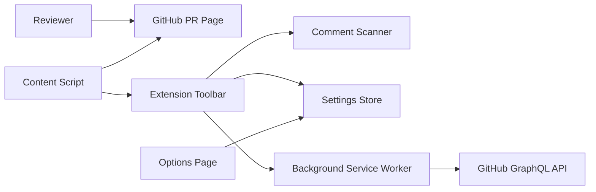
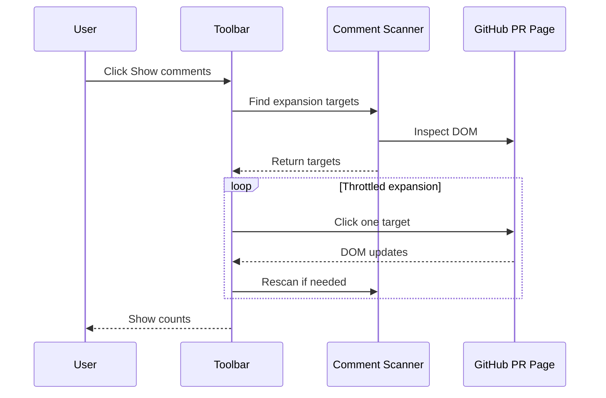
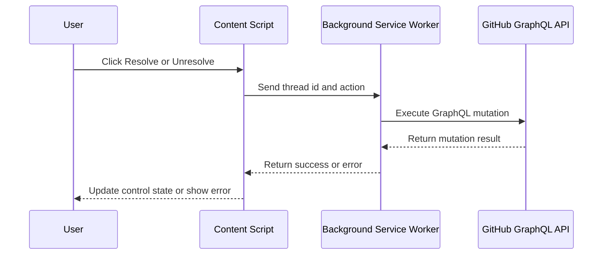

# Basic Design Overview

## 0. Document Set

This basic design consists of the following documents:

- `docs/design/basic/00-overview.md`: Overall purpose, component summary, and implementation milestones.
- `docs/design/basic/01-architecture.md`: Extension architecture, module responsibilities, and runtime boundaries.
- `docs/design/basic/02-data-flow.md`: User interaction, DOM expansion, settings, and GitHub GraphQL data flows.
- `docs/design/basic/03-infrastructure.md`: Chrome Extension packaging, permissions, build, and deployment assumptions.
- `docs/design/basic/04-security.md`: Permission, token, API mutation, and DOM safety design.
- `docs/design/basic/05-non-functional.md`: Performance, reliability, maintainability, usability, and testability requirements.

## 1. System Purpose

This Chrome Extension improves GitHub Pull Request review workflows by exposing hidden comments and optionally controlling review thread resolution state. The design separates read-only comment expansion from write-capable `Resolve/Unresolve` operations.

The key architectural rule is separation of capability:

- `Comment` features inspect and interact with the current page only.
- `Resolve/Unresolve` features call the GitHub GraphQL API and require explicit user configuration.

## 2. High-Level Architecture



## 3. Components

### 3.1 Content Script

The content script runs on supported GitHub PR pages. It is responsible for:

- Detecting whether the current page is a PR page.
- Injecting a single toolbar.
- Scanning the DOM for expandable comment controls.
- Performing throttled click-based expansion for read-only comment display.
- Rendering optional resolve controls only when enabled.
- Sending API-related requests to the background service worker.

### 3.2 Comment Scanner

The comment scanner classifies GitHub UI controls that reveal hidden review content.

Target kinds:

- `load-more`
- `show-more`
- `resolved-thread`
- `outdated-thread`
- `full-conversation`

The scanner should avoid relying on a single GitHub CSS class. It should combine button text, accessible labels, semantic containers, and nearby thread metadata.

### 3.3 Toolbar

The toolbar is injected into the PR page and provides:

- `Show comments`
- `Show resolved`
- `Resolve tools` status
- `Stop`
- `Settings`
- Progress counts for expanded, remaining, and failed targets.

The toolbar should be compact and visually compatible with GitHub's existing interface.

### 3.4 Background Service Worker

The background service worker handles privileged extension work:

- Reading settings for API calls.
- Sending GitHub GraphQL requests.
- Keeping tokens out of page-injected code where practical.
- Returning structured success or failure responses to the content script.

### 3.5 Options Page

The options page stores user settings:

- `Enable comment expansion`
- `Auto expand comments`
- `Include resolved threads`
- `Include outdated threads`
- `Enable resolve controls`
- `Allow bulk resolve/unresolve`
- `GitHub token`
- `GitHub Enterprise hosts`

## 4. Data Flow

### 4.1 Comment Expansion Flow



### 4.2 Resolve/Unresolve Flow



## 5. Settings Model

The extension settings should use this logical model:

```ts
export type ExtensionSettings = {
  enableCommentExpansion: boolean;
  autoExpandComments: boolean;
  includeResolvedThreads: boolean;
  includeOutdatedThreads: boolean;
  enableResolveControls: boolean;
  allowBulkResolveUnresolve: boolean;
  githubEnterpriseHosts: string[];
  githubToken?: string;
};
```

Default values:

- `enableCommentExpansion`: `true`
- `autoExpandComments`: `true`
- `includeResolvedThreads`: `true`
- `includeOutdatedThreads`: `false`
- `enableResolveControls`: `false`
- `allowBulkResolveUnresolve`: `false`
- `githubEnterpriseHosts`: `[]`
- `githubToken`: unset

## 6. Permissions

Initial MVP permissions:

- `storage` for settings.
- Host permission for `https://github.com/*`.
- Content script match for `https://github.com/*/*/pull/*`.

Post-MVP Enterprise support should add configurable host matching carefully. If static host permissions are insufficient for user-configured hosts, the design should use optional host permissions requested by the options page.

## 7. API Design

Resolve operations should use GitHub GraphQL mutations:

- `resolveReviewThread`
- `unresolveReviewThread`

The content script should not perform these API calls directly. It should send an extension message to the background service worker with the action and thread id. The background service worker should attach authentication and call the GitHub API endpoint.

## 8. Error Handling

Comment expansion errors:

- If a target disappears, count it as skipped or failed and continue.
- If repeated scans find no new targets, stop the run.
- If the user clicks `Stop`, cancel the queue immediately after the current operation.

Resolve errors:

- Missing token: show authentication-required state.
- API permission error: show a concise permission error.
- Network failure: show retryable failure.
- Partial bulk failure: show success and failure counts.

## 9. Security Design

The extension should default to read-only behavior. `Resolve/Unresolve` must be opt-in and disabled by default.

Token handling rules:

- Do not require a token for comment expansion.
- Do not expose token values in page DOM.
- Do not send tokens to non-GitHub endpoints.
- Keep token usage limited to background service worker API requests.

## 10. Test Strategy

Unit tests:

- PR URL parser.
- Settings default and persistence mapping.
- Comment scanner classification.
- GraphQL request construction.

Integration tests:

- HTML fixtures for collapsed comments.
- HTML fixtures for resolved and outdated threads.
- Toolbar injection idempotence.

E2E tests:

- Load the extension in Chromium.
- Open a fixture PR page.
- Click `Show comments`.
- Verify hidden sections become visible.
- Verify resolve controls are absent by default and appear only when enabled.

## 11. Implementation Milestones

Milestone 1: Extension scaffold and PR page toolbar.

Milestone 2: Read-only `Comment` expansion.

Milestone 3: Options page and independent feature toggles.

Milestone 4: GitHub GraphQL client and per-thread `Resolve/Unresolve`.

Milestone 5: Bulk operations, Enterprise host support, and E2E hardening.
