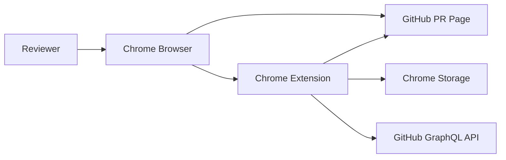

# Architecture Design

## 1. Architecture Goal

The extension must make hidden GitHub Pull Request comments easier to inspect while keeping state-changing operations explicit and isolated. The core architectural decision is to split the product into two capability groups:

- `Comment`: read-only page behavior that expands existing GitHub UI controls.
- `Resolve/Unresolve`: optional API behavior that mutates GitHub review thread state.

This separation keeps the MVP useful without authentication and limits the risk surface of write operations.

## 2. System Context



The extension runs inside Chrome. It observes GitHub Pull Request pages through a content script and stores user preferences through Chrome storage. When `Resolve/Unresolve` is enabled, the background service worker calls the GitHub GraphQL API.

## 3. Runtime Components

### 3.1 Manifest

`manifest.json` defines the Chrome Extension boundary.

Responsibilities:

- Declare Manifest V3.
- Register content scripts for GitHub PR pages.
- Register the background service worker.
- Register the options page.
- Declare required permissions.

Initial permissions:

- `storage`
- Host access for `https://github.com/*`

Later Enterprise support may use optional host permissions for configured GitHub Enterprise domains.

### 3.2 Content Script

The content script is the only component that directly reads and modifies the GitHub PR page DOM.

Responsibilities:

- Parse the current URL and determine whether the page is a supported PR.
- Inject one toolbar per page view.
- Watch GitHub client-side navigation and page re-rendering.
- Scan for comment expansion targets.
- Perform throttled expansion by invoking GitHub's existing page controls.
- Render resolve controls only when enabled by settings.
- Send resolve requests to the background service worker.

The content script must be idempotent. Re-running initialization must not duplicate the toolbar or attach duplicate event listeners.

### 3.3 Comment Scanner

The comment scanner is a pure or mostly pure module used by the content script.

Responsibilities:

- Inspect a DOM subtree.
- Identify buttons or links that reveal hidden PR review content.
- Classify each target as `load-more`, `show-more`, `resolved-thread`, `outdated-thread`, or `full-conversation`.
- Apply settings such as `includeResolvedThreads` and `includeOutdatedThreads`.

Detection should use multiple signals:

- Accessible names such as `aria-label`.
- Visible button text.
- Nearby labels such as `resolved`, `outdated`, or `hidden`.
- Semantic placement inside PR review thread containers.

The scanner should avoid depending on one GitHub CSS class because GitHub can change private class names.

### 3.4 Toolbar

The toolbar is the user-facing control surface injected into the PR page.

Responsibilities:

- Show `Show comments`, `Show resolved`, `Stop`, and `Settings`.
- Show whether resolve tools are off, unavailable, or enabled.
- Show progress counts: expanded, remaining, failed, and skipped.
- Expose bulk resolve actions only when bulk operations are enabled.

The toolbar should use GitHub-like visual density and avoid covering PR content.

### 3.5 Settings Store

Settings are persisted with Chrome storage.

Responsibilities:

- Provide defaults.
- Read and write user settings.
- Notify content scripts when settings change.
- Keep `Comment` and `Resolve/Unresolve` toggles independent.

Logical settings:

```ts
export type ExtensionSettings = {
  enableCommentExpansion: boolean;
  autoExpandComments: boolean;
  includeResolvedThreads: boolean;
  includeOutdatedThreads: boolean;
  enableResolveControls: boolean;
  allowBulkResolveUnresolve: boolean;
  githubEnterpriseHosts: string[];
  githubToken?: string;
};
```

### 3.6 Background Service Worker

The background service worker is the API boundary.

Responsibilities:

- Receive messages from the content script.
- Validate requested actions.
- Read authentication settings.
- Send GraphQL requests to GitHub.
- Return structured results to the content script.

The content script should not attach tokens to API requests directly. Keeping API calls in the background worker reduces token exposure to page-level scripts and DOM inspection.

### 3.7 Options Page

The options page is the configuration UI.

Responsibilities:

- Configure comment expansion settings.
- Configure resolve controls.
- Configure GitHub token.
- Configure GitHub Enterprise hosts.
- Explain when authentication is required.

## 4. Module Layout

Expected implementation layout:

```text
manifest.json
src/
  background/
    index.ts
    githubGraphql.ts
  content/
    index.ts
    commentScanner.ts
    toolbar.ts
    resolveControls.ts
  options/
    index.html
    index.ts
  shared/
    githubPrUrl.ts
    messages.ts
    settings.ts
  test/
    commentScanner.test.ts
    githubGraphql.test.ts
    githubPrUrl.test.ts
    settings.test.ts
```

## 5. Message Contracts

The content script and background worker should communicate with typed messages.

```ts
export type ExtensionMessage =
  | { type: 'GET_SETTINGS' }
  | { type: 'OPEN_OPTIONS' }
  | { type: 'RESOLVE_THREAD'; threadId: string; prUrl: string }
  | { type: 'UNRESOLVE_THREAD'; threadId: string; prUrl: string };

export type ExtensionResponse =
  | { ok: true; data?: unknown }
  | { ok: false; error: { code: string; message: string } };
```

Expected error codes:

- `AUTH_REQUIRED`
- `PERMISSION_DENIED`
- `NETWORK_ERROR`
- `GITHUB_API_ERROR`
- `INVALID_THREAD_ID`
- `UNSUPPORTED_HOST`

## 6. Thread Identification Strategy

The extension needs review thread IDs only for `Resolve/Unresolve`. The design should use a staged strategy:

- First, try to read stable thread identifiers exposed in GitHub page markup or embedded data.
- If the page does not expose usable IDs, query GitHub GraphQL using the current PR owner, repo, and number.
- Map fetched thread data back to visible thread containers using file path, line, author, timestamp, and comment body excerpts.

The MVP can postpone resolve controls until reliable thread ID extraction is implemented. Comment expansion does not require thread IDs.

## 7. Dependency Direction

Allowed dependencies:

- `content/index.ts` may depend on `toolbar`, `commentScanner`, `resolveControls`, `settings`, `messages`, and `githubPrUrl`.
- `background/index.ts` may depend on `githubGraphql`, `settings`, `messages`, and `githubPrUrl`.
- `commentScanner.ts` should not depend on Chrome APIs.
- `githubGraphql.ts` should not depend on DOM APIs.
- `shared` modules should not depend on content or background modules.

This keeps scanner and API logic testable outside the browser extension runtime.
