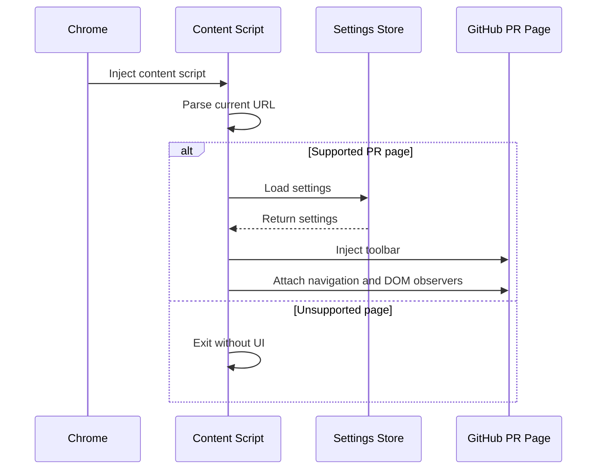
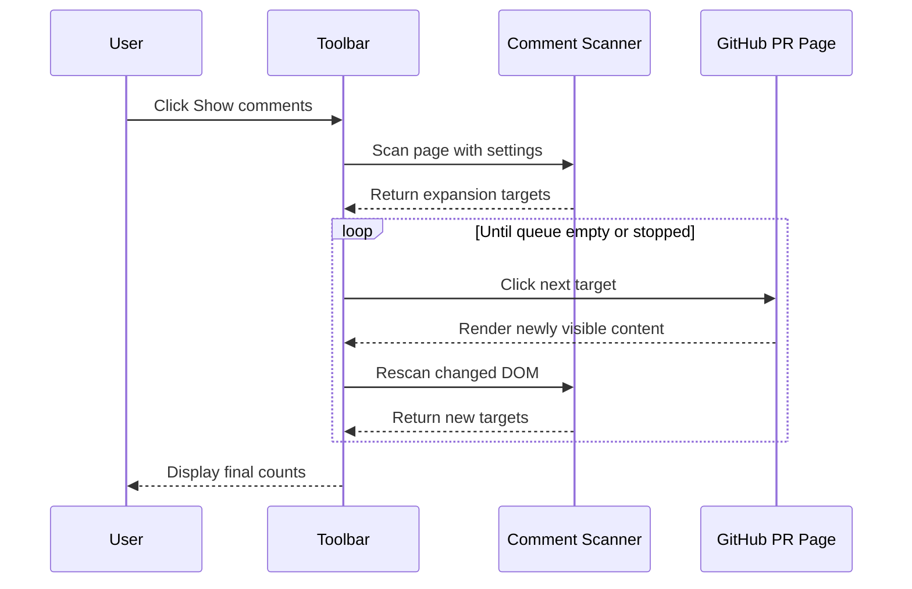
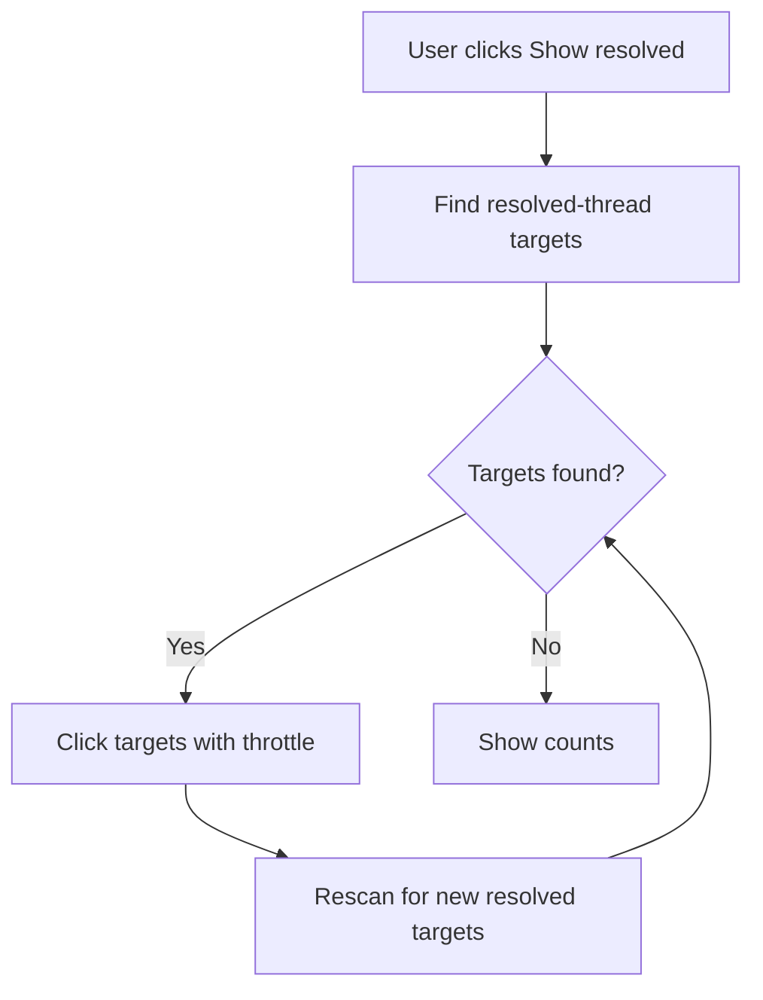
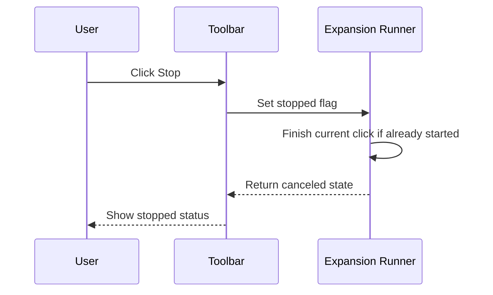
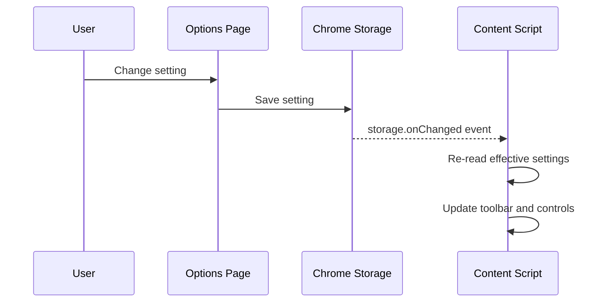
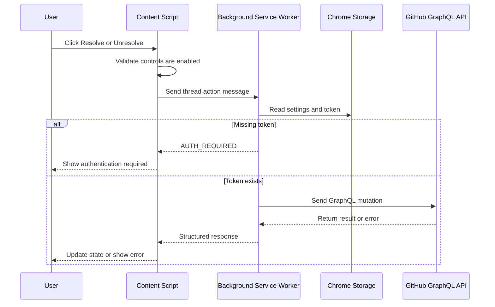
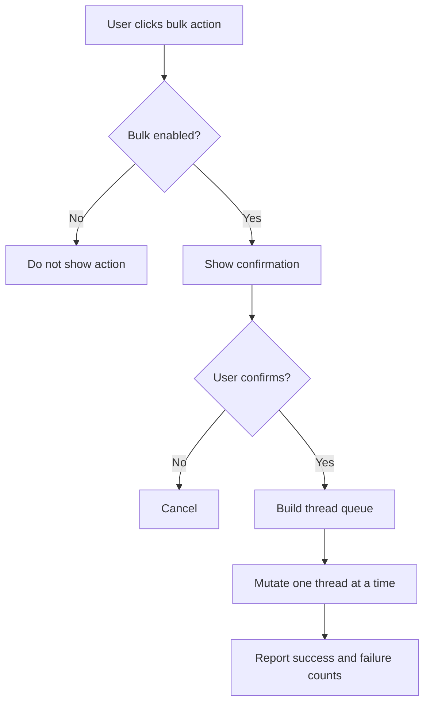

# Data Flow Design

## 1. Scope

This document defines the main runtime flows for the GitHub PR Comment and Resolve Chrome Extension. The flows are separated by capability so that read-only comment expansion and write-capable resolve operations remain independent.

## 2. Page Initialization Flow



Rules:

- Initialization must be safe to run multiple times.
- The toolbar must be inserted once.
- The extension must handle GitHub client-side navigation by re-checking the URL.
- If settings cannot be loaded, the content script should use safe defaults with resolve controls disabled.

## 3. Comment Expansion Flow



Input data:

- Current DOM.
- Current `ExtensionSettings`.
- Current expansion run state.

Output data:

- Expanded count.
- Remaining count.
- Failed count.
- Skipped count.

Expansion run state:

```ts
export type ExpansionRunState = {
  running: boolean;
  stopped: boolean;
  expanded: number;
  failed: number;
  skipped: number;
  seenTargetKeys: Set<string>;
};
```

Target deduplication should use a stable key derived from label, kind, nearby thread path, and DOM position. If a target disappears after a click, it should not be retried indefinitely.

## 4. Show Resolved Flow

`Show resolved` is a specialized comment expansion flow. It temporarily scans only for resolved thread expansion targets regardless of the broader `includeResolvedThreads` setting.



Rules:

- `Show resolved` must not call `resolveReviewThread` or `unresolveReviewThread`.
- The action only reveals resolved content already present or loadable from the GitHub page.
- If resolve controls are disabled, `Show resolved` still works as a read-only feature.

## 5. Stop Flow



Rules:

- Stop must prevent the next queued click.
- Stop does not need to undo comments already expanded.
- Stop must be available during long-running expansion.

## 6. Settings Update Flow



Rules:

- Turning off `enableResolveControls` must remove or disable extension resolve buttons.
- Turning off `enableCommentExpansion` must disable `Show comments` and auto expansion.
- Token changes should affect only future API calls.

## 7. Resolve/Unresolve Flow



Mutation inputs:

- `threadId`: GitHub GraphQL node ID for the review thread.
- `action`: `resolve` or `unresolve`.
- `endpoint`: GitHub API endpoint derived from host settings.
- `token`: user-configured GitHub token.

Mutation outputs:

- Success with affected thread ID.
- Structured error.

## 8. Bulk Resolve/Unresolve Flow

Bulk operations are post-MVP and must be guarded.



Rules:

- Bulk actions are hidden by default.
- Bulk actions must process sequentially or with a very small concurrency limit.
- Partial failures must not abort reporting.

## 9. Error Data Model

```ts
export type ExtensionError = {
  code:
    | 'AUTH_REQUIRED'
    | 'PERMISSION_DENIED'
    | 'NETWORK_ERROR'
    | 'GITHUB_API_ERROR'
    | 'INVALID_THREAD_ID'
    | 'UNSUPPORTED_HOST'
    | 'DOM_TARGET_MISSING'
    | 'UNKNOWN_ERROR';
  message: string;
  retryable: boolean;
};
```

User-facing errors should be short. Developer-facing details can be logged to the extension console.

## 10. Data Boundaries

Data that may be read by the content script:

- PR page URL.
- DOM text and accessible labels.
- Extension settings except token when avoidable.
- Thread IDs only when required for resolve controls.

Data that should stay in the background worker or storage:

- GitHub token.
- Raw API request headers.
- Raw API error details containing sensitive metadata.

Data sent to GitHub:

- GraphQL query or mutation.
- Thread ID.
- Repository owner, repository name, and PR number if a query is needed.
