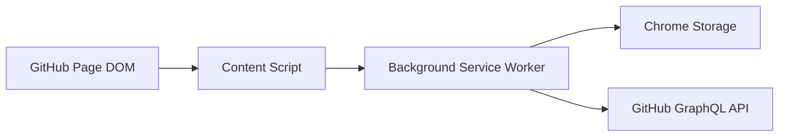

# Security Design

## 1. Security Goal

The extension must be safe by default. Comment expansion is read-only and should not require credentials. `Resolve/Unresolve` changes GitHub state, so it must require explicit enablement, authentication, and clear user action.

## 2. Trust Boundaries



Trust boundaries:

- GitHub page DOM is not trusted as an API contract.
- Content script is exposed to page structure and should not hold sensitive data longer than necessary.
- Background service worker is the boundary for authenticated API calls.
- Chrome storage contains user settings and may contain a GitHub token.
- GitHub API is trusted only over HTTPS and only for configured GitHub hosts.

## 3. Permission Model

Initial permissions:

- `storage`: required for settings.
- `https://github.com/*`: required to run on GitHub PR pages and call GitHub API.

Design constraints:

- Do not request `<all_urls>`.
- Do not request tabs permission unless a concrete feature requires it.
- Do not request clipboard, downloads, history, or scripting permissions for MVP.
- Enterprise hosts should be optional and user-configured.

## 4. Default Safety

Default settings:

- `enableCommentExpansion`: true
- `autoExpandComments`: true
- `includeResolvedThreads`: true
- `includeOutdatedThreads`: false
- `enableResolveControls`: false
- `allowBulkResolveUnresolve`: false

Security rationale:

- Read-only comment expansion is available by default.
- Automatic expansion is on so the extension immediately performs its primary read-only value on supported PR pages.
- Resolve controls are off because they mutate GitHub state.
- Bulk resolve operations are off because they can affect many threads at once.

## 5. Token Handling

Token requirements:

- No token is required for `Comment` features.
- A token is required only for `Resolve/Unresolve`.
- The token must never be inserted into page DOM.
- The token must never be logged.
- The token must never be sent to non-GitHub endpoints.

Storage rule:

- Prefer `chrome.storage.local` for token storage.
- Store non-sensitive settings in `chrome.storage.sync` when sync is desired.

API rule:

- The background service worker reads the token and attaches it to GraphQL requests.
- The content script sends only action metadata such as `threadId` and `action`.

## 6. Authentication and Authorization

Required GitHub permission depends on the target repository and token type. The extension should not assume write access. It should detect and report permission errors from GitHub.

User-facing states:

- Resolve controls disabled: no mutation UI.
- Resolve controls enabled without token: show authentication required.
- Token configured without permission: show permission denied after API response.
- Token configured with permission: allow individual resolve/unresolve actions.

## 7. Mutation Safety

`Resolve/Unresolve` operations must be explicit.

Rules:

- Individual buttons mutate only one thread.
- Bulk buttons are hidden unless `allowBulkResolveUnresolve` is true.
- Bulk operations require confirmation.
- Bulk operations report partial success and failures.
- Failed mutations must not update the UI as if they succeeded.

Mutation messages should include:

```ts
type ResolveMutationRequest = {
  threadId: string;
  action: 'resolve' | 'unresolve';
  prUrl: string;
};
```

The background worker must validate:

- `threadId` is present.
- `action` is one of the allowed values.
- `prUrl` belongs to a supported GitHub host.
- Resolve controls are enabled.
- Token exists.

## 8. DOM Safety

The extension injects UI into a third-party page. It should avoid unsafe DOM writes.

Rules:

- Use DOM APIs such as `textContent` for dynamic text.
- Do not write untrusted strings with `innerHTML`.
- Do not execute scripts from the page.
- Do not depend on page-defined JavaScript functions.
- Do not add global CSS that can broadly change GitHub layout.

The toolbar should use a unique root attribute, for example:

```text
data-github-pr-comment-tools-root="true"
```

This prevents duplicate injection and scopes CSS selectors.

## 9. Network Safety

Allowed endpoints:

- `https://api.github.com/graphql`
- Configured GitHub Enterprise GraphQL endpoints.

Network rules:

- Use HTTPS only.
- Attach authorization only to allowed GitHub API endpoints.
- Reject unsupported hosts.
- Do not follow user-provided arbitrary API URLs unless Enterprise endpoint override is explicitly implemented and validated.

## 10. Error Privacy

Error messages shown in the toolbar should be concise and should not expose tokens or raw request headers.

Examples:

- `Authentication required. Configure a GitHub token in extension settings.`
- `GitHub denied this operation. Check token permissions.`
- `Network error. Retry the operation.`

Developer logs may include GraphQL error codes but must not include authorization headers.

## 11. Threats and Mitigations

| Threat | Impact | Mitigation |
| --- | --- | --- |
| Token leaks into DOM | Token compromise | Keep API calls in background worker and never render token values |
| Accidental bulk resolve | PR review state corruption | Bulk disabled by default and confirmation required |
| GitHub DOM changes | Incorrect expansion or missed comments | Multi-signal scanner and tests with fixtures |
| Malicious Enterprise host config | Token sent to attacker | Validate host format and require explicit host permission |
| Duplicate content script initialization | Multiple clicks or repeated mutations | Idempotent toolbar and run state guards |
| Over-broad permissions | Increased browser warning and risk | Avoid `<all_urls>` and request only needed hosts |

## 12. Security Acceptance Criteria

- Comment expansion works without a token.
- Resolve controls are absent when disabled.
- Resolve actions fail closed when token is missing.
- Tokens are not visible in page DOM.
- Tokens are not printed in console logs.
- The extension does not request `<all_urls>`.
- Bulk resolve operations cannot run without explicit enablement and confirmation.
