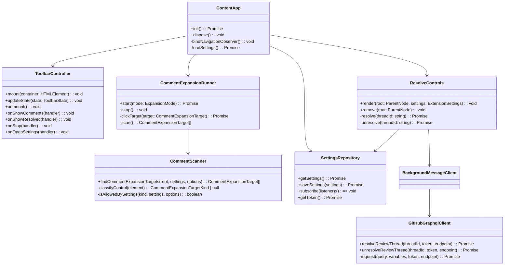

# Class and Module Design

## 1. Scope

This document defines the TypeScript modules, exported types, functions, and responsibility boundaries for the GitHub PR Comment and Resolve Chrome Extension.

The design keeps `Comment` behavior read-only and independent from `Resolve/Unresolve` behavior. Modules that inspect or click GitHub page elements must not know about GitHub tokens. Modules that call GitHub GraphQL must not read or modify the page DOM.

## 2. Module Diagram



## 3. Shared Types

### 3.1 Settings

File: `src/shared/settings.ts`

```ts
export type ExtensionSettings = {
  schemaVersion: 1;
  enableCommentExpansion: boolean;
  autoExpandComments: boolean;
  includeResolvedThreads: boolean;
  includeOutdatedThreads: boolean;
  enableResolveControls: boolean;
  allowBulkResolveUnresolve: boolean;
  githubEnterpriseHosts: string[];
  githubToken?: string;
};

export const DEFAULT_SETTINGS: ExtensionSettings = {
  schemaVersion: 1,
  enableCommentExpansion: true,
  autoExpandComments: false,
  includeResolvedThreads: true,
  includeOutdatedThreads: false,
  enableResolveControls: false,
  allowBulkResolveUnresolve: false,
  githubEnterpriseHosts: [],
};
```

Rules:

- `githubToken` is optional.
- `Resolve/Unresolve` must treat a missing token as `AUTH_REQUIRED`.
- `Comment` features must not require `githubToken`.

### 3.2 Pull Request URL

File: `src/shared/githubPrUrl.ts`

```ts
export type PullRequestRef = {
  host: string;
  owner: string;
  repo: string;
  number: number;
};

export function parsePullRequestUrl(url: string): PullRequestRef | null;
export function isSupportedPullRequestUrl(url: string, settings: ExtensionSettings): boolean;
export function getGraphqlEndpoint(host: string): string;
```

Rules:

- `https://github.com/{owner}/{repo}/pull/{number}` is supported by default.
- Enterprise hosts are supported only when configured.
- Invalid or non-numeric PR numbers return `null`.

### 3.3 Messaging

File: `src/shared/messages.ts`

```ts
export type ExtensionMessage =
  | { type: 'GET_SETTINGS' }
  | { type: 'OPEN_OPTIONS' }
  | { type: 'RESOLVE_THREAD'; threadId: string; prUrl: string }
  | { type: 'UNRESOLVE_THREAD'; threadId: string; prUrl: string };

export type ExtensionResponse<T = unknown> =
  | { ok: true; data: T }
  | { ok: false; error: ExtensionError };

export type ExtensionError = {
  code:
    | 'AUTH_REQUIRED'
    | 'PERMISSION_DENIED'
    | 'NETWORK_ERROR'
    | 'GITHUB_API_ERROR'
    | 'INVALID_THREAD_ID'
    | 'UNSUPPORTED_HOST'
    | 'DOM_TARGET_MISSING'
    | 'UNKNOWN_ERROR';
  message: string;
  retryable: boolean;
};
```

Rules:

- Message handlers must always return `ExtensionResponse`.
- Raw thrown exceptions must be converted to `ExtensionError`.
- Token values must not appear in messages sent to content scripts.

## 4. Content Modules

### 4.1 Content App

File: `src/content/index.ts`

Responsibilities:

- Entry point for the content script.
- Owns initialization and cleanup.
- Coordinates settings, toolbar, scanner, expansion runner, and resolve controls.

Public functions:

```ts
export async function initContentApp(): Promise<void>;
export function disposeContentApp(): void;
```

Implementation rules:

- Use a root marker such as `data-github-pr-comment-tools-root="true"` to prevent duplicate toolbar injection.
- Re-run initialization on GitHub client-side navigation.
- If current URL is unsupported, remove extension UI and observers.
- Use safe defaults if settings cannot be loaded.

### 4.2 Toolbar Controller

File: `src/content/toolbar.ts`

Types:

```ts
export type ToolbarState = {
  status: 'ready' | 'expanding' | 'stopped' | 'completed' | 'error';
  expanded: number;
  remaining: number;
  failed: number;
  skipped: number;
  resolveTools:
    | 'disabled'
    | 'auth-required'
    | 'enabled';
  message?: string;
};
```

Responsibilities:

- Create toolbar DOM.
- Bind button handlers.
- Render status counts.
- Render disabled states.

Rules:

- Use `textContent` for dynamic text.
- Do not use untrusted HTML.
- Buttons must have accessible names.
- The toolbar must remain usable when GitHub rerenders nearby content.

### 4.3 Comment Scanner

File: `src/content/commentScanner.ts`

Types:

```ts
export type CommentExpansionTargetKind =
  | 'load-more'
  | 'show-more'
  | 'resolved-thread'
  | 'outdated-thread'
  | 'full-conversation';

export type CommentExpansionTarget = {
  element: HTMLElement;
  kind: CommentExpansionTargetKind;
  label: string;
  key: string;
};

export type CommentScannerOptions = {
  mode: 'all-comments' | 'resolved-only';
};
```

Functions:

```ts
export function findCommentExpansionTargets(
  root: ParentNode,
  settings: ExtensionSettings,
  options: CommentScannerOptions,
): CommentExpansionTarget[];
```

Detection rules:

- Search `button`, `a`, and elements with `role="button"`.
- Normalize text by trimming whitespace and lowercasing.
- Classify `load more`, `show more`, `view more`, and `view full conversation`.
- Classify resolved or outdated targets from visible text, `aria-label`, and nearby container text.
- Exclude disabled, hidden, or already-clicked controls.

### 4.4 Comment Expansion Runner

File: `src/content/commentExpansionRunner.ts`

Types:

```ts
export type ExpansionMode = 'all-comments' | 'resolved-only';

export type ExpansionResult = {
  expanded: number;
  failed: number;
  skipped: number;
  stopped: boolean;
};
```

Responsibilities:

- Build target queue from scanner results.
- Click targets one by one.
- Wait between clicks.
- Rescan after DOM updates.
- Stop when requested.

Rules:

- Default click delay should be 300 to 700 ms.
- Default max operations should be 100.
- A disappearing target should be counted as skipped or failed, not retried forever.
- The runner must expose `stop()`.

### 4.5 Resolve Controls

File: `src/content/resolveControls.ts`

Responsibilities:

- Add per-thread resolve/unresolve controls when enabled.
- Remove controls when disabled.
- Send mutation messages to background worker.
- Update local UI only after a successful response.

Rules:

- No controls appear when `enableResolveControls` is false.
- Controls are disabled when token is missing.
- Bulk controls appear only when `allowBulkResolveUnresolve` is true.
- Bulk operations require confirmation.

Thread ID extraction:

- Prefer stable GitHub-provided GraphQL node IDs if present in page data.
- If unavailable, call a later GraphQL thread discovery query and map results to DOM containers.
- If thread ID cannot be determined, do not render a mutation button for that thread.

## 5. Background Modules

### 5.1 Background Entry

File: `src/background/index.ts`

Responsibilities:

- Register `chrome.runtime.onMessage`.
- Dispatch message by type.
- Read settings.
- Validate permissions and required token.
- Call `githubGraphql.ts`.
- Return structured responses.

Validation rules:

- Reject unsupported hosts.
- Reject empty thread IDs.
- Reject resolve actions when `enableResolveControls` is false.
- Return `AUTH_REQUIRED` when token is missing.

### 5.2 GitHub GraphQL Client

File: `src/background/githubGraphql.ts`

Functions:

```ts
export async function resolveReviewThread(
  threadId: string,
  token: string,
  endpoint: string,
): Promise<GitHubMutationResult>;

export async function unresolveReviewThread(
  threadId: string,
  token: string,
  endpoint: string,
): Promise<GitHubMutationResult>;
```

Types:

```ts
export type GitHubMutationResult = {
  threadId: string;
};
```

GraphQL mutation shape:

```graphql
mutation ResolveReviewThread($threadId: ID!) {
  resolveReviewThread(input: { threadId: $threadId }) {
    thread {
      id
      isResolved
    }
  }
}
```

```graphql
mutation UnresolveReviewThread($threadId: ID!) {
  unresolveReviewThread(input: { threadId: $threadId }) {
    thread {
      id
      isResolved
    }
  }
}
```

Rules:

- Use `POST`.
- Use `Authorization: Bearer ${token}`.
- Use HTTPS endpoints only.
- Convert GraphQL `errors` to `GITHUB_API_ERROR` or `PERMISSION_DENIED`.

## 6. Options Modules

### 6.1 Options Page

Files:

- `src/options/index.html`
- `src/options/index.ts`

Responsibilities:

- Render settings form.
- Save settings.
- Validate Enterprise host entries.
- Hide or explain token field depending on resolve controls.

Rules:

- Save non-sensitive settings separately from token if possible.
- Do not show token in plain text after save unless user explicitly reveals it.
- Validate hostnames before saving Enterprise hosts.

## 7. Test Modules

Expected unit tests:

- `src/test/githubPrUrl.test.ts`
- `src/test/settings.test.ts`
- `src/test/commentScanner.test.ts`
- `src/test/githubGraphql.test.ts`

Expected integration tests:

- Toolbar idempotence.
- Comment expansion on fixture DOM.
- Resolve controls hidden by default.
- Resolve controls disabled without token.

## 8. Implementation Order

1. Shared settings and URL parser.
2. Manifest and content app skeleton.
3. Toolbar controller.
4. Comment scanner.
5. Expansion runner.
6. Options page.
7. Background message contract.
8. GraphQL client.
9. Resolve controls.
10. Bulk operations.
