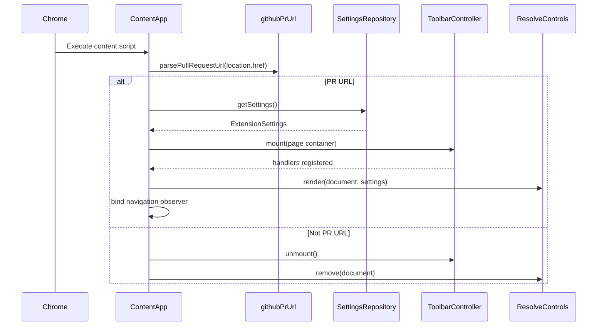
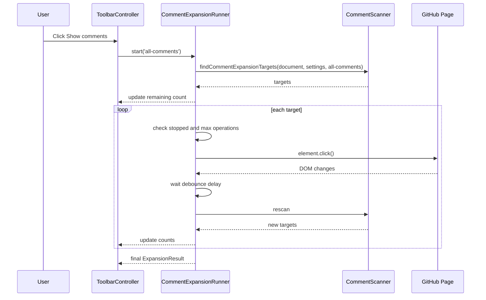
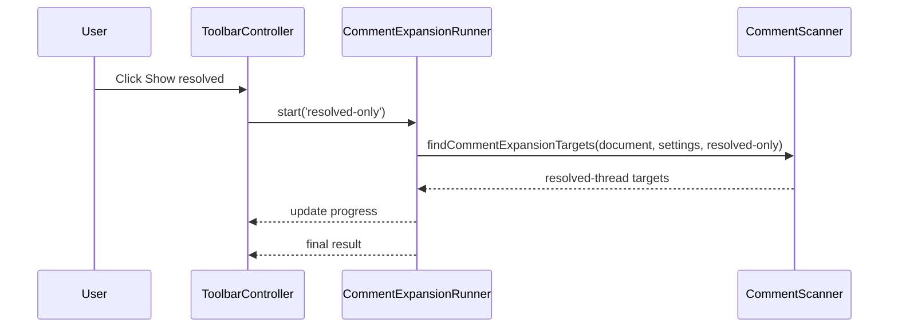
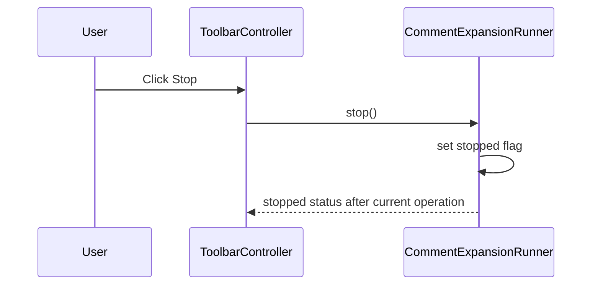
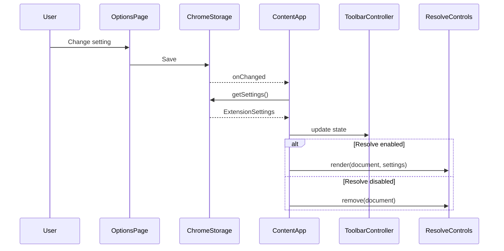
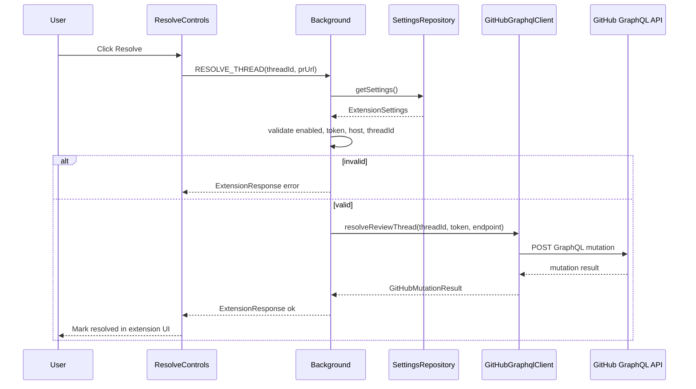
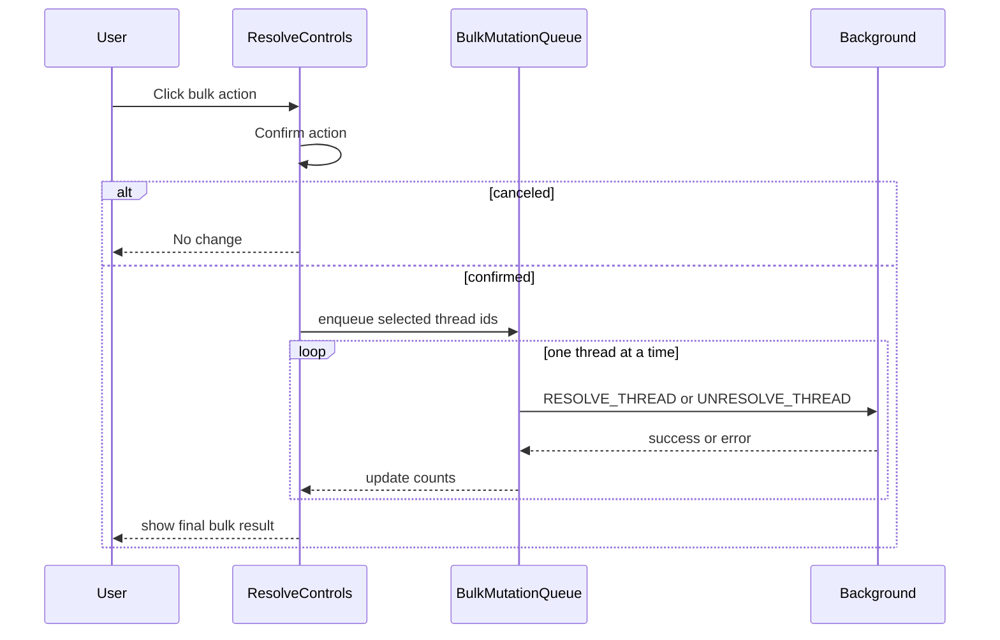
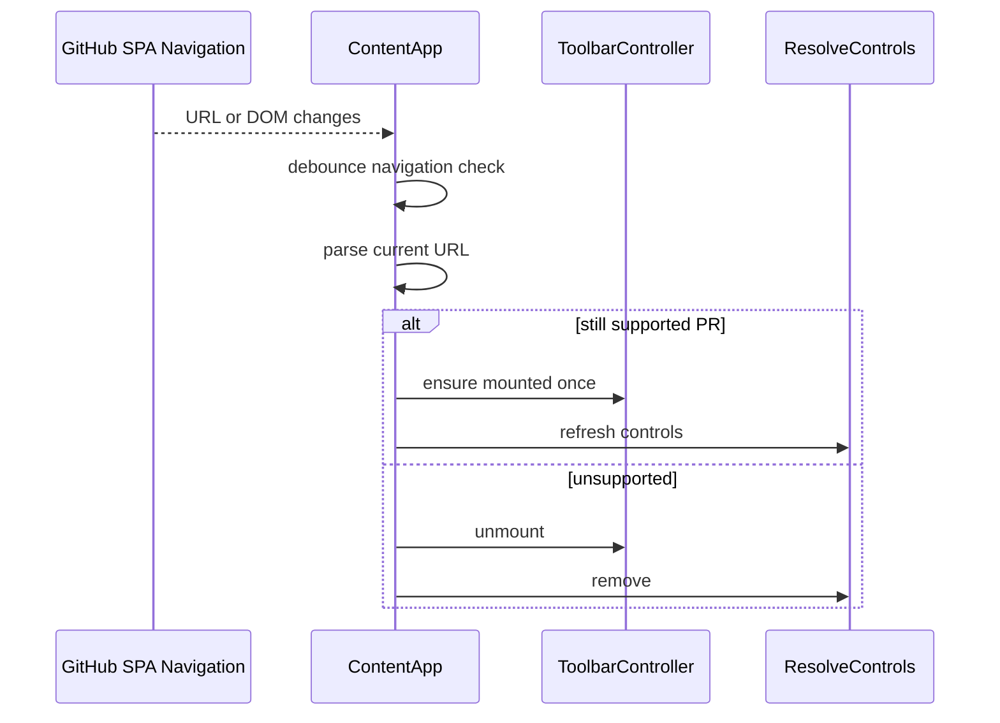

# Sequence Design

## 1. Scope

This document defines runtime sequences for initialization, comment expansion, settings changes, resolve/unresolve operations, and bulk operations.

## 2. Content Script Initialization

Detailed behavior:

1. `initContentApp()` parses `location.href`.
2. If unsupported, it removes extension UI and exits.
3. If supported, it loads settings.
4. It mounts the toolbar if no toolbar root exists.
5. It wires toolbar handlers to the expansion runner and background messages.
6. It renders resolve controls only when settings allow.
7. It subscribes to storage changes and GitHub client-side navigation.

Failure behavior:

- If settings loading fails, use defaults with `enableResolveControls=false`.
- If toolbar insertion point cannot be found, append near the top of the PR main content when possible.
- If no safe insertion point exists, log a development warning and exit without throwing.

## 3. Show Comments

Important rules:

- The runner must not run two expansion jobs at the same time.
- A second `Show comments` click while running should be ignored or converted to a status message.
- The target queue must deduplicate by target key.
- The runner must stop when there are no new targets after a scan.

## 4. Show Resolved

Important rules:

- `Show resolved` is display-only.
- It must not call GitHub GraphQL mutations.
- It should scan resolved thread controls even when the general `includeResolvedThreads` setting is off, because the user explicitly chose the resolved-only command.

## 5. Stop Expansion

Important rules:

- Stop must be synchronous from the user's perspective; the toolbar should immediately show `Stopped` or `Stopping`.
- The runner may finish the currently executing click.
- It must not start another click after the stopped flag is set.

## 6. Settings Change

Important rules:

- Changes should affect future operations immediately.
- A currently running comment expansion should keep its initial settings until stopped or finished.
- Disabling resolve controls should remove or disable injected resolve buttons.

## 7. Resolve Thread

Important rules:

- The UI must not mark a thread as resolved until the API succeeds.
- If the API returns a permission error, show a concise permission message.
- The raw token must not leave the background service worker.

## 8. Unresolve Thread

The `Unresolve` sequence is the same as `Resolve Thread`, except:

- The message type is `UNRESOLVE_THREAD`.
- The background worker calls `unresolveReviewThread`.
- The UI marks the thread as unresolved only after success.

## 9. Bulk Resolve/Unresolve

Important rules:

- Bulk operations are not part of MVP.
- Bulk operations are hidden unless explicitly enabled.
- Process sequentially in initial implementation.
- Continue after individual failures and report partial results.

## 10. GitHub Client-Side Navigation

Important rules:

- Navigation handling must be debounced.
- Toolbar roots from old PR pages must be cleaned up.
- Expansion run state should reset on PR URL change.
