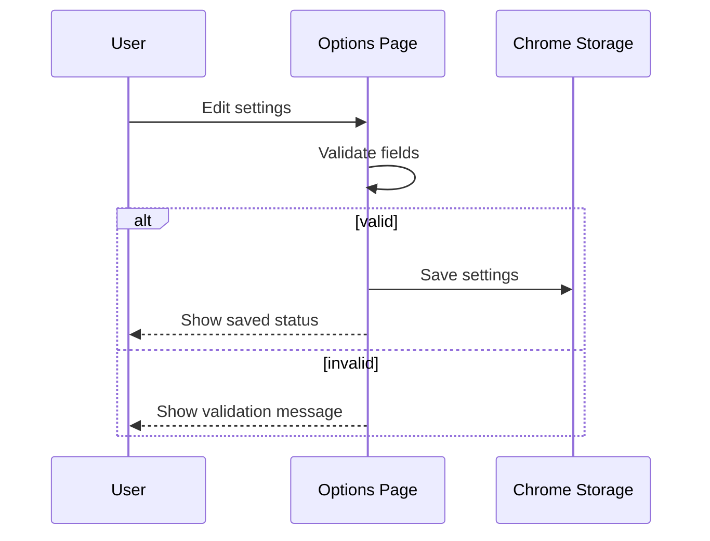

# Options Page Module Detailed Design

## 1. Scope

The options page lets users configure read-only comment behavior and optional resolve/unresolve behavior independently.

## 2. Files

- `src/options/index.html`
- `src/options/index.ts`
- `src/options/options.css` if styles are split.

## 3. Form Fields

Comment settings:

- `Enable comment expansion`
- `Auto expand comments`
- `Include resolved threads`
- `Include outdated threads`

Resolve settings:

- `Enable resolve controls`
- `Allow bulk resolve/unresolve`
- `GitHub token`

Host settings:

- `GitHub Enterprise hosts`

## 4. Field Behavior

Rules:

- `Allow bulk resolve/unresolve` is disabled unless `Enable resolve controls` is enabled.
- Token field is optional unless resolve controls are enabled.
- Token field should not display the saved token by default.
- Enterprise hosts should be entered as hostnames, one per line.

## 5. Validation

Enterprise host validation:

- Required format: hostname only.
- No protocol.
- No path.
- No spaces.
- Must not be `github.com` because it is built in.

Token validation:

- Empty token is allowed when resolve controls are disabled.
- Empty token should show warning when resolve controls are enabled.
- Do not validate token by calling GitHub automatically in MVP.

## 6. Save Flow

## 7. Storage Rules

- Save non-sensitive settings under `settings`.
- Save token separately under `githubToken`.
- Normalize empty token to missing token.
- Trim Enterprise host entries and deduplicate them.

## 8. Accessibility

Rules:

- Every input must have a visible label.
- Validation messages must be associated with the relevant field.
- Save status should be announced through a live region.
- Keyboard-only users must be able to save all settings.

## 9. Tests

Required tests:

- Defaults render correctly.
- Saving comment settings does not require token.
- Enabling resolve controls without token shows warning.
- Enterprise host validation rejects protocol and path.
- Token is not displayed after reload unless reveal behavior is explicitly implemented.
